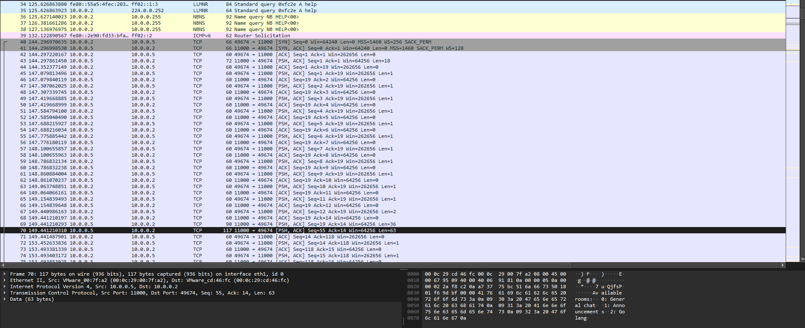
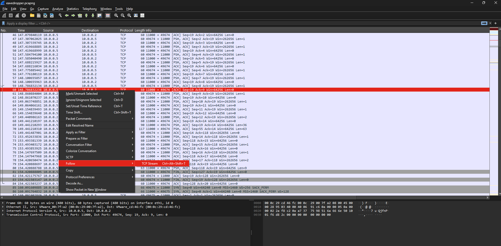
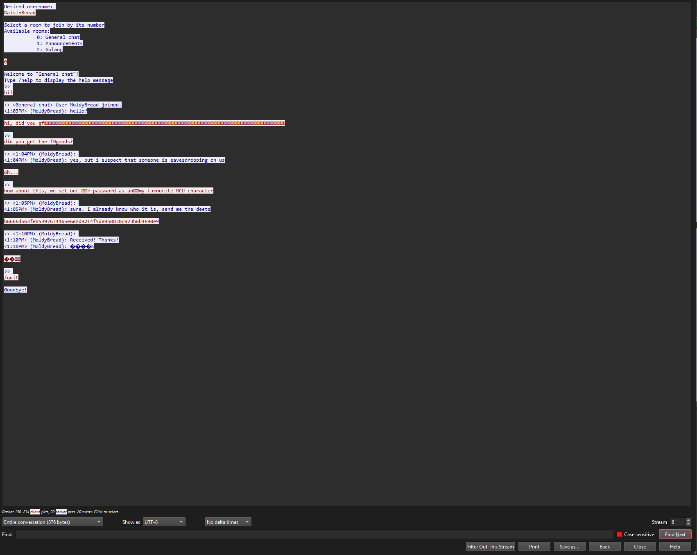
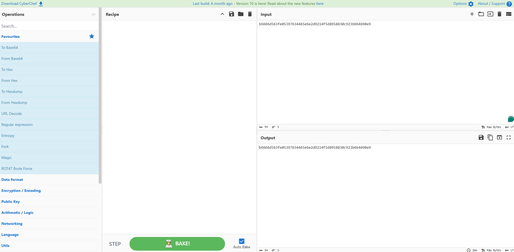
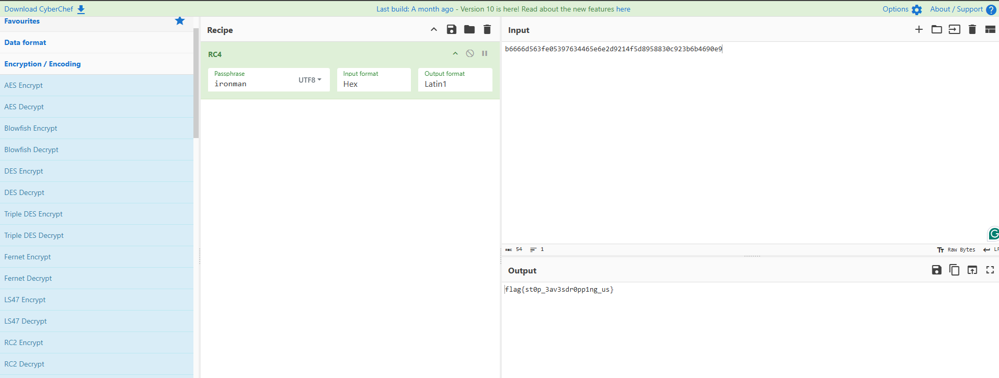

# Eavesdropper

This challenge simulates a man-in-the-middle attack, where a law enforcement agency is listening to a conversation of 2 breads, not knowing that they are being listened in to. This challenge exposes the participants on encryption, and standard networking concepts like TCP streams

> Two breads are communicating about some secret information. We have intercepted their communication lines. Can you help us decode what they were talking about?

This PCAP is a simplified PCAP that is usually not the case in a real-world scenario. I have ommitted most of the garbage transmission for an easier focus on the actual challenge.

Looking at the PCAP file, you will see a long chain of TCP communication between 10.0.0.2/10.0.0.1 and 10.0.0.5. Since this a telnet server, it does not matter which of the 2 we choose, we will be able to see the full conversation regardless of which stream we choose

You can right click any of the packets and select follow TCP stream as such

You will then get this screen, which is a plaintext view of the conversation they had

If you do not get the above screen, just close the window and find another packet further down the PCAP and follow that stream, you would eventually get a similar screen as you see above

In the image, we can see there is a suspicious long line of number and letters as one of the message: b6666d563fe05397634465e6e2d9214f5d8958830c923b6b4690e9 -> This is type of data is usually known as Hex encoding, where data is represented using 0-9 and a-f. Most networking protocols use this encoding OR they use Binary to encode the data

Also one of the breads said that the password is his favourite MCU character. This would point out to you that the data is probably encrypted. With that knowledge, if you have read more on encryption, RC4 is usually used in CTFs and is one of the only few encryption schemes that only needs a password and no IVs (https://en.wikipedia.org/wiki/Initialization_vector)

With this knowledge, you can head to CyberChef to try to decrypt the data

You can load in the "RC4 Encrypt" module at the "Operations" tab into the "Recipe" tab, and trial and error the MCU characters as the password
After trying, you would eventually find out that the password is "ironman" and will get the below result, which is the flag for the challenge!

Flag is flag{st0p_3av3sdr0pp1ng_us}

