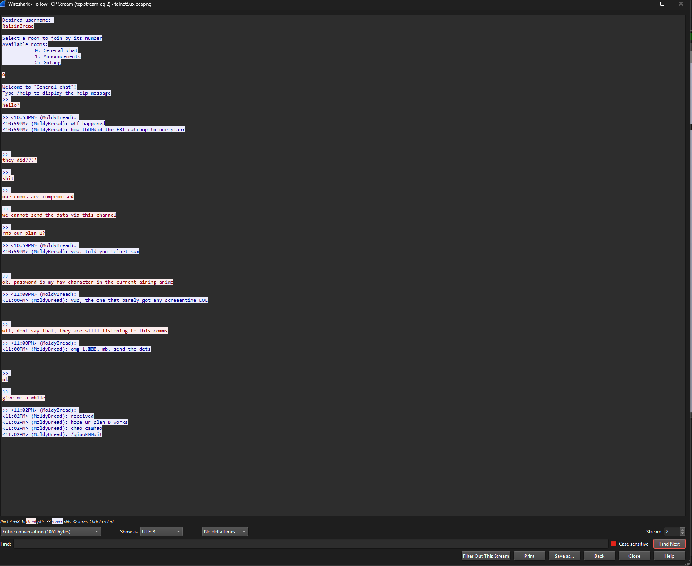

# TelnetSux

This challenge is almost the same with Eavesdropper challenge, granted that the securet information is not sent via the Telnet Chat as the two breads found out that they are being listened to. This exposes participants to different way an attacker can hide data and how to navigate a PCAP file that containes a lot of grabage data (Windows Telemetry data)

> The two breads are back at it again. This time, they seem to be using something special. Can you help us intercept their message again?

This PCAP contains a lot of random data, which tries to mimick real life network traffic. It is more of a OSINT + Forensics challenge (Will get to that later)

Looking at the PCAP file, you can do the same "Follow TCP Stream" on one of the connections from 10.0.0.1 -> 10.0.0.5 or 10.0.0.2 -> 10.0.0.5 until you see this in the TCP Stream

In this Telnet chat, you can realise that they are sending the data via another channel, while probably still encrypting the data as one of the breads said that their password is his favourite character that is in the currently airing anime. So I realised that many people got stuck here in the actual CTF event. During the time of creating this challenge, the currently airing anime (in SG context), was JJK and Demon Slayer. (The actual anime in question here is Demon Slayer)
If you went to GV or Shaw Theatres' website, you would have gotten that information. For the actual password, it was quite easy, but you would first need the data right?

To get the data, you will need to analyse the PCAP further. To do so, we can note that one of the bread said he received the data, which allows us to narrow down when and which packet the data was sent

You can double click the relevant data and Wireshark will highlight the packet for you in the TCP Stream. We note that the "received" is on packet number 1140
We can then clear all the filters and look above packet 1140 in the original PCAP

You will realised that there is a suspicious Ping data, out of the random with only one request and reply, together further up, you will also see an attempt to connect to "www.telnetsux.com" which is actually just to throw you off your trail :)

Since we know that the ping might be more worth while to investigate as the machines never really connected to the "www.telnetsux.com" website, we can look at the HEX data of the ping packet (Commonly used to hide data in plain sight in networks) [https://medium.com/aardvark-infinity/icmp-based-data-exfiltration-leaking-information-through-disguised-ping-requests-5e9cbb160d74]

You will then get this below

Note that the ending of the ping packet is usually the data, which is in Hex most of the time -> dc92b76da5d9673fa6213030fb4c26f3d067b84afb8efd088ba1

Once we get this data, we can then use CyberChef with the RC4 encryption module to try to decrypt. You can brute force the anime characters that appeared in the Demon Slayer Infinity Castle Arc movie and eventually, you will get the password to be "nezuko", which decrypts the Hex encrypted data to our flag!

Flag: flag{y_u_u51n6_73ln37_l0l}
