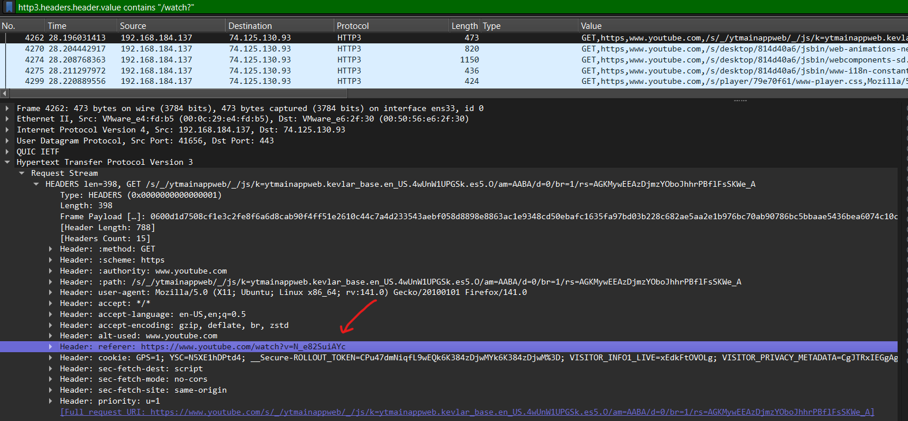

# The WiFi Incident

This challenge simulates a victim downloading malware off the internet. Upon running the malware, it connects to the malicious actor's Command and Control server where they are able to run commands on the victim's computer. The attacker then exfiltrates file from the victim's computer.

Participants are provided with the PCAP file of the incident to analyze.

The following context is provdied to the participant and this incident is broken down into 7 separate challenges/parts.

> Someone compromised one of our client's system and exfiltrated some important documents. Luckily, we managed to capture the network traffic from the moment of compromise. Can you help us to investigate this matter to identify what was stolen and how it happened?

## Part 1 - Identify the C2 Server

> We found some C2 traffic in the network traffic. What is the IP address of the C2 server and the protocol that was used for the C2 communications?
> 
> Note: If the IP address is 1.2.3.4 and the protocol is ICMP, the flag is flag{1.2.3.4-ICMP}

We can skim through the packets in the PCAP file. Most of the noise can be easily ignored since TLS 1.3 and QUIC packets are encrypted and would not yield anything useful.

Looking through the raw TCP packets, we can find the C2 communiactions


If we look at the corresponding packet, we can get the IP address and protocol for the flag.


`flag{209.97.171.172-TCP}`

## Part2 - The Malicious Command

> What is the command that the attacker used to zip up the files to be exfiltrated? Wrap the entire command in the `flag{...}` format.

If we continue scrolling the TCP stream that was shown two pictures above, you will find the full `zip` command that is used to store the exfiltrated file.

`flag{zip -r extract.zip /home/user/* -x home/user/snap/* -x home/user/.*}`

## Part 3 - Valuable Artifact

> Extract the file that was exfiltrated and investigate the contents. There is an important artifact within the ZIP file that would allow us to further investigate the network capture and reveal more information. What is the name of the file? Wrap the entire command in the `flag{...}` format.

If we continue looking at the C2 TCP stream, we can identify that the file is exfiltrated via BASE64 with the following format.

```
C2_DOWNLOAD_CHUNK:1:64:1536:UEsDBAoAAAAAANBTJlsAAAAAAAAAAAAAAAASABwAaG9tZS91c2VyL0Rlc2t0b3AvVVQJAAPHnLtoyJy7aHV4CwABBOgDAAAE6AMAAFBLAwQUAAAACABmJQ1beyCGAFkAAABcAAAAGgAcAGhvbWUvdXNlci9EZXNrdG9wL3RvZG8udHh0VVQJAANgp5toYKebaHV4CwABBOgDAAAE6AMAABXJsQ5AMBQF0N1X3JGhTYnELGYh8QXFQ0ORvhafj+UsR6ALvTUe9Jy0M2HYtLGMuAxzEgm0gRe4LFViuq1QspA5vJ75L0endoSR7PExrJgOh6qpM1yGjY9eUEsDBAoAAAAAANBTJlsAAAAAAAAAAAAAAAAUABwAaG9tZS91c2VyL0RvY3VtZW50cy9VVAkAA8ecu2iTnrtodXgLAAEE6AMAAAToAwAAUEsDBAoAAAAAAOiQJVsAAAAAAAAAAAAAAAAcABwAaG9tZS91c2VyL0RvY3VtZW50cy9GaW5hbmNlL1VUCQADVLa6aMecu2h1eAsAAQToAwAABOgDAABQSwMEFAAAAAgAY04EW/+umF2KAAAArAAAADsAHABob21lL3VzZXIvRG9jdW1lbnRzL0ZpbmFuY2UvaW52b2ljZV8yMDI1LTA4LTEyX0lOVi0yODQxLmNzdlVUCQADChKQaAoSkGh1eAsAAQToAwAABOgDAABty0ELgjAUAOB70H/YD3iLuYrsKAoiiEhW96lDBu49cW+B/77o0KnTd/oqfJEbbEOQz84iQ+YpfsjjulocNiiiLQxb6NhwDPtd1TylTk8J3I1fHNogbtQTuyGImkdIjqlSB6WgKwvQSp+luspEwwMX48Zf19BGnCaaRRaZkPwmatMHuOg/O4X2e99QSwMEFAAAAAgAA2ULWx4vJi/HAAAACwEAADEAHABob21lL3VzZXIvRG9jdW1lbnRzL0ZpbmFuY2UvZXhwZW5zZXNfYXVnXzIwMjUuY3N2VVQJAAMmdJloJnSZaHV4CwABBOgDAAAE6AMAAG2OwWrDMBBE74X8g8gphbWRhB2c3lK5MYW2FOweelTMNhHYklmtUvL3FfTQFnqZ07x501pGMDlOga7QYhzJLeyCh/0ckmcwiQj9eAUTIhv0jLS60VLXhWwKWcNA9oITdGSPgoMYJ5c7Iro8q5qyktB3LTy8dH+gZ7RThPWAdhZT8uMZxPtwWIOqtqX+B1E76MMHf1pC6Bw/Zdcr4ezSLDYRLcc7ofQt7KqmlN/44/BD6wb6tCz5WYS3/r4w4pyOEZTelvUv2RdQSwMECgAAAAAA6JAlWwAAAAAAAAAAAAAAABcAHABob21lL3VzZXIvRG9jdW1lbnRzL0hSL1VUCQADVLa6aMecu2h1eAsAAQToAwAABOgDAABQSwMEFAAAAAgAaGwVWzbGX9vrAAAAOwEAADUAHABob21lL3VzZXIvRG9jdW1lbnRzL0hSL3BvbGljeV90cmF2ZWxfYWxsb3dhbmNlX3YyLnR4dFVUCQADFLCmaBSwpmh1eAsAAQToAwAABOgDAABFjkFOwzAURPc5xawQlUhJgxBqWKEidUErVSoXcJ0f+MKOzfdPquw4BCfkJDgIxHZmNO89GedM/4I9WwlpSko+4aCEnbb4+vjEs5iRHC6wJ+NyFRzbCZdjfQXqOrL...
```

We can write a python script to parse out the base64 string to get the `extract.zip` file.

```py
from scapy.all import rdpcap, IP, TCP, Raw
import base64

# Input file
input_file = "./challenge.pcapng"

# IPs to filter
src_ip = "192.168.184.137"
dst_ip = "209.97.171.172"

# Read packets
packets = rdpcap(input_file)

b64_file = ""
stream = b""

for pkt in packets:
    if IP in pkt and TCP in pkt and Raw in pkt:
        if pkt[IP].src == src_ip and pkt[IP].dst == dst_ip:
            payload = pkt[Raw].load
            print(payload)
            if len(payload) != 4:
                stream += payload

start = stream.find(b"C2_DOWNLOAD_START")
end = stream.find(b"C2_DOWNLOAD_COMPLETE")
b64_file = b''.join([i.split(b":")[-1] for i in stream[start:end].split(b"C2_DOWNLOAD_CHUNK")][1:])
print(b64_file)
with open("out.zip", "wb") as f:
    f.write(base64.b64decode(b64_file.decode()))
```

Upon extracting the `extract.zip` file, we can unzip to look at the files within.

The sslkey.log file contains the keys that can be used to decrypt the HTTPS traffic in the pcap.

```
❯ cat sslkey.log 
# SSL/TLS secrets log file, generated by NSS
CLIENT_RANDOM 7fc0dea0692657f7bce69a938974a629ff379a28518f1542b1f8543c30222f11 90d646d259051b42cfa4b514463e84730e4cd8766a9f1c8cb7f158261bbb5c402a2c5b6e35f72e302a3214e2b187a0d2
CLIENT_RANDOM f353321faea950020be0ed208fb7726420591fe8ec5c485e59aa063afb651a9b d57fe3059d27c6511aaae83df415ef31af832036b4acc94da7e95887fe5a5093d36a41d9ec682ddf9d898c6ce39f7a75
CLIENT_RANDOM 66094cdb843bb8113e3a9f51f0a4ba3b102989e225ad66ef5f7a3adfe2cde8de 45da9fd590ee41d4ce9334fb61542bed9f2aef03f68cb652489a22873b4d89ccc768e2c2164e19d7f6148f888af1fc06
```

`flag{sslkey.log}`

## Part 4 - Decrypted Traffic

> Decrypt the TLS traffic using the sslkey.log file that you found. Look at the browser traffic that is being sent on the network. What is the full URL of the youtube video that the victim watched.

I did a separate writeup to explain how to analyze decrypted HTTP/3 packets [here](https://blog.elmo.sg/posts/parsing-decrypted-zoom_Installer.exe.README.txtquic-traffic-in-wireshark).

Following the writeup, we can use the `http3.headers.header.value contains "/watch?"` filter to find the youtube video.



`flag{https://www.youtube.com/watch?v=N_e82SuiAYc}`

## Part 5 - Server Architecture

> From the PCAP, can you identify what is the web server that is used to host the website with the malicious program? (i.e. nginx, apache, flask) Wrap your answer in the `flag{...}` format.

We can identify that the web server `https://fastwifispeeds.lol` share the same IP as the C2 server that we identified earlier.

This means that this is likely the web server that we are looking for, which uses `Caddy`


`flag{Caddy}`

## Part 6 - Malware Download Link

> What is the full download link for the malicious file?

We can see that the victim downloads an ELF file from `https://fastwifispeeds.lol/netboostpro.elf`


`flag{https://fastwifispeeds.lol/netboostpro.elf}`

## Part 7 - Malware Extraction

> Upon extracting the file, you should have a file of 8836 bytes. Provide the SHA256 hash of the file to ensure that you have extracted it correctly.

Following the writeup posted [here](https://blog.elmo.sg/posts/parsing-decrypted-zoom_Installer.exe.README.txtquic-traffic-in-wireshark), we can extract the file.

```py
import hashlib
malware = bytes.fromhex("...")
print(hashlib.sha256(x).hexdigest())
# 21b4e88b1cea4bf0a926acdf2e19b0def2ef4fb21ef2a8c0cfb937be7c179013
```

`flag{21b4e88b1cea4bf0a926acdf2e19b0def2ef4fb21ef2a8c0cfb937be7c179013}`

## Part 8 - Identifying the Hidden Functionality

> This is an extra mile. Reverse engineer the malware to fully unravel its functionalities and find the hidden flag within.

This was honestly a challenge for smurfs and requires reverse-engineering the malware.

If you have some experience with reverse engineering malware, you will identify that this is actually a modified UPX packed program.

```
❯ strings client  | grep "upx"
$Info: This file is packed with the APT executable packer http://upx.sf.net $
```

However, all the `UPX!` signatures has been modified into `APT!` which prevents us from directly unpacking the malware. However, we can easily fix this by modifying it back.

```sh
❯ perl -pi -e 's/APT/UPX/g' client # modify all APT to UPX
❯ upx -d client
                       Ultimate Packer for eXecutables
                          Copyright (C) 1996 - 2024
UPX 4.2.4       Markus Oberhumer, Laszlo Molnar & John Reiser    May 9th 2024

        File size         Ratio      Format      Name
   --------------------   ------   -----------   -----------
     22363 <-      8836   39.51%   linux/amd64   client

Unpacked 1 file.
```

Subsequently, we can throw the program into [IDA](https://hex-rays.com/ida-free) or [Ghidra](https://github.com/NationalSecurityAgency/ghidra) to decompile and reverse-engineer.

### Reverse-Engineering the malware

By clicking around, we can identify the command parser/command tree here.

```c
unsigned __int64 __fastcall sub_1F9D(unsigned int fd)
{
  int n7; // [rsp+1Ch] [rbp-164h]
  int j; // [rsp+20h] [rbp-160h]
  int k; // [rsp+24h] [rbp-15Ch]
  _BYTE *i; // [rsp+28h] [rbp-158h]
  char *s1; // [rsp+30h] [rbp-150h]
  char *s1_1; // [rsp+38h] [rbp-148h]
  __int64 v8; // [rsp+48h] [rbp-138h]
  _BYTE *v9; // [rsp+68h] [rbp-118h]
  char s[264]; // [rsp+70h] [rbp-110h] BYREF
  unsigned __int64 v11; // [rsp+178h] [rbp-8h]

  v11 = __readfsqword(0x28u);
  s1 = (char *)sub_16FC(fd);
  if ( !s1 )
  {
    if ( !dword_5050 )
      puts("Connection to server lost");
    exit(1);
  }
  if ( !strncmp(s1, "C2_", 3uLL) )
  {
    s1_1 = s1 + 3;
    if ( strncmp(s1 + 3, "BEACON", 6uLL) )
    {
      if ( *s1_1 )
      {
        if ( !strncmp(s1_1, "DOWNLOAD:", 9uLL) )
        {
          for ( i = s1 + 12; *i == 32 || *i == 9; ++i )
            ;
          sub_1C31(fd, i);
        }
        else
        {
          n7 = 0;
          for ( j = 0; j <= 6; ++j )
          {
            if ( ((unsigned __int8)s1_1[j] ^ 0x42) == byte_317F[j] ) // obfuscated command??
              ++n7;
          }
          if ( n7 == 7 )
          {
            v9 = malloc(0x23uLL);
            for ( k = 0; k <= 33; ++k )
              v9[k] = byte_3188[k] ^ byte_31B0[k]; // whats this?
            v9[34] = 0;
            snprintf(s, 0x100uLL, "%s", v9);
            sub_15C9(fd, s);
          }
          else
          {
            v8 = sub_17B8(s1_1);
            sub_15C9(fd, v8);
          }
        }
      }
    }
  }
  return v11 - __readfsqword(0x28u);
}
```

There is an encrypted command `byte_317F` that is XORed with a single-byte key `0x42` that will returns a 33 byte string by XORing `byte_3188` and `byte_31B0` together.

If we decrypt these two strings, we can get the flag.

```python
print(bytes([i^0x42 for i in bytes.fromhex("040E0305120E11")]))
# b'FLAGPLS'

print(bytes([x^y for (x,y) in zip(bytes.fromhex("C4251A1E9DDD4A6E2FE62DF6291AC081B49386FE861F57494861DC7F4AB398F384E900"), bytes.fromhex("A2497B79E6BB7A1B4182728241299FE985F7E2CDE840347B1707EF4B3EC6EAC0A59400"))]))
# b'flag{f0und_th3_h1dd3n_c2_f34tur3!}\x00'
```
This means that if the server sent the `FLAGPLS` command to the C2 client, it would send the flag back to the server.

`flag{f0und_th3_h1dd3n_c2_f34tur3!}`